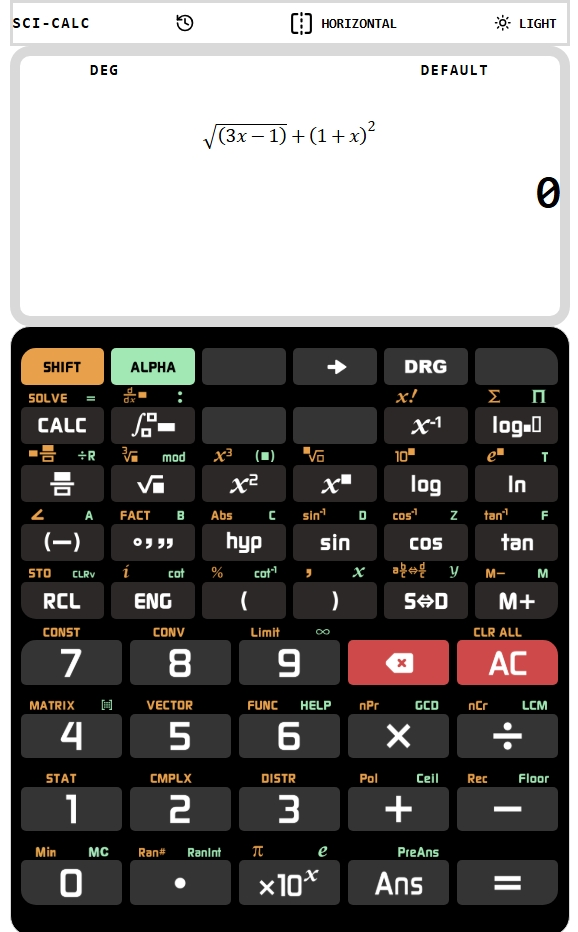

This is a [Next.js](https://nextjs.org) project bootstrapped with [`create-next-app`](https://nextjs.org/docs/app/api-reference/cli/create-next-app).

## Getting Started

Bu proje Casio 911 ES **Hesap makinasından** esinlenerek React ile next server ortamında yapılıyor. Tam çalışan uygulama  [Mathda com](https://mathda.com/calculator/) adresindebulunmaktadır. Anladığım kararıyla, **Astro** framework ve **Svelte** ile yapılmış.

React ile nasıl oluyor diye başladım. React beni çok sinir etti. Nasıl seviliyor anlamadım. daha geliştiricem. şu an itibarıyla **52 bilimsel fonksiyon** kullanılıyor. Bazı evrensel sabitler ekrana çağrılıyor. Dikey ve yatay görünüm destekleniyor.

Repoyu **public** hale getirdim. Versiyon 0.2.0 olarak dağıtımı yapılmıştır. Vercel serveri üzerinde çalışan uygulama ise yandaki link ile görülebilir.
**Version 0.3.0**
Bu versiyonda asciimath formüller üretilmekte;
Bu ifadeler projenin kendi **RPN** parseri  ve fonksiyon kütüphanesi ile hesaplanmaktadır. (rpn.js)
Matematik ifadeler Tommi Johtela tarafından yapılan [asciimath2ml](https://github.com/johtela/asciimath2ml) kütüphanesi ile mathml formuna dönüştürülüp, ekranda görüntülenmektedir. Ben react için hazırlanan npm paketini [asciimath2ml ](https://www.npmjs.com/package/asciimath2ml) kullandım. Mahml bütün browserlar tarafından inline olarak desteklenmektedir.
Formüllerde girilmesi gereken yerler yanıp sönen ? olarak görülmekte sağ ok tuşu ile giriş tamamlanmaktadır.
Aşağıda ekran görüntüsü vardır.

This is a [Next.js](https://nextjs.org) project started with [`create-next-app`](https://nextjs.org/docs/app/api-reference/cli/create-next-app).

## Getting Started in English

This project is inspired by the Casio 911 ES **calculator** and is being built with React in a Next server environment. A fully functional application can be found on [Mathda.com](https://mathda.com/calculator/). It was built anonymously using the **Astro** framework and **Svelte**.

I started by asking how it works with React. The reaction really annoyed me. I don't understand how it's liked. I will develop it further. Currently, **52 standard functions** are used. Some universal constants are called to the screen. Vertical and horizontal views are supported.

I have made the repository **public**. The version is 0.2.0. The application running on the Vercel server can be seen via the link below.
**Version 0.3.0**
This version generates ASCIImath formulas;
These expressions are calculated using its own **RPN** parser and function library (rpn.js).
Mathematical expressions are converted into mathml formulas using the [asciimath2ml](https://github.com/johtela/asciimath2ml) library created by Tommi Johtela and displayed on the screen. I included the npm package [asciimath2ml](https://www.npmjs.com/package/asciimath2ml) distributed for Reaction. Mathml is supported inline by all browsers.
The places where input is required in the formulas are shown as blinking ?, and input is completed by pressing the right arrow key.

